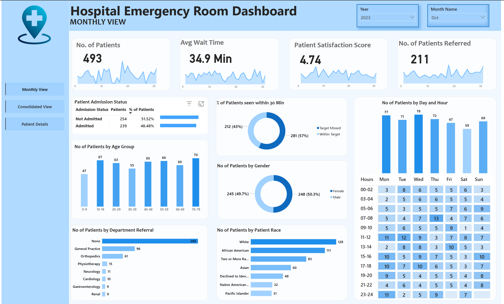
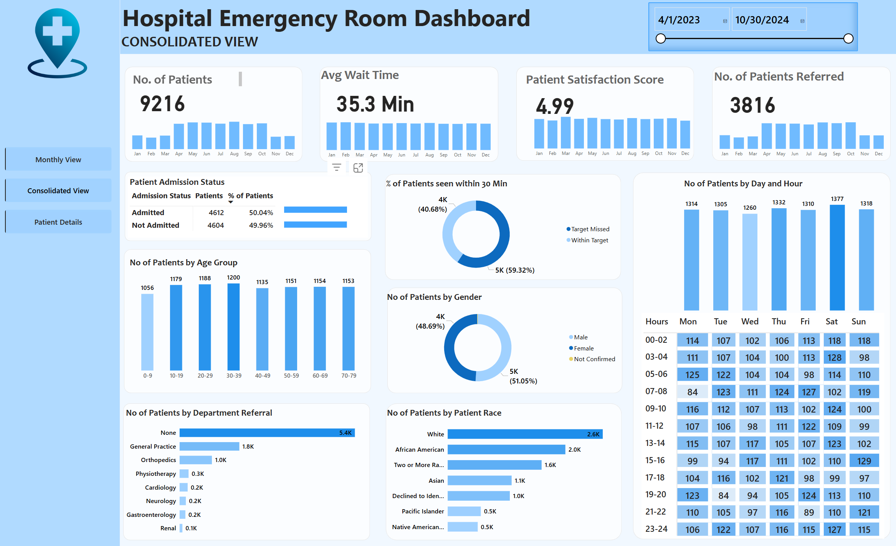
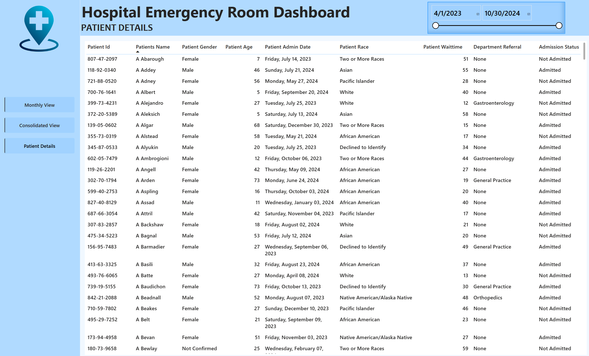

# Hospital Emergency Room Dashboard

## Project Objective
This dashboard provides a real-time overview of key performance indicators (KPIs) related to emergency room operations. It enables hospital staff to monitor patient flow, identify areas for improvement, and ensure efficient and effective patient care.

---

## Key Features
- **Patient Volume**: Tracks the total number of patients treated and provides insights into patient arrival patterns.
- **Wait Times**: Monitors average wait times and identifies potential bottlenecks in patient flow.
- **Patient Satisfaction**: Tracks patient satisfaction scores to gauge overall patient experience.
- **Referral Data**: Provides information on patient referrals and their sources.
- **Patient Demographics**: Analyzes patient demographics, including age, gender, and race.
- **Patient Admission Status**: Tracks the number of patients admitted and not admitted.
- **Department Referrals**: Identifies the departments referring the most patients.
- **Peak Busy Periods**: Highlights the busiest days and hours for emergency room visits.

---

## Key Insights
- **High Patient Volume**: 9,216 unique patients treated over 19 months.
- **Moderate Wait Times**: Average wait time of 35.3 minutes indicates room for improvement in patient flow.
- **Patient Satisfaction**: Average satisfaction score of 4.99 out of 10 suggests areas for improvement.
- **Common Referrals**: General Practice and Orthopedics are the top referral sources.
- **Peak Busy Periods**: Mondays, Saturdays, and Tuesdays, with peak hours at 11 AM, 7 PM, 1 PM, and 11 PM.
- **Age Demographics**: Adults aged 30-39 are the largest group, followed by 20-29.
- **Racial Diversity**: Diverse patient population, with White patients being the majority.
- **Admission Patterns**: Around 50% of patients are admitted, while the rest are treated and released.

---

## Benefits
- **Improved Patient Care**: Faster triage, reduced wait times, and better patient flow.
- **Enhanced Operational Efficiency**: Identifies areas for improvement in staffing and resource allocation.
- **Data-Driven Decision Making**: Supports strategic planning for staffing and service delivery during peak hours.
- **Targeted Interventions**: Pinpoints areas to enhance patient satisfaction and address specific concerns.

---
---

## **Access the Dashboard**  
Explore the live dashboard here: **[Link to Online Reports Page](https://app.powerbi.com/view?r=eyJrIjoiMjdjMTY1ZDItNjI0Ni00Y2YzLWE0ZTMtMWNmNzEzYzk2ZDAwIiwidCI6ImU4ZmUxZDE4LTQxMjAtNDlmYy04NjMxLWQzNjE5M2FjMGMxZSJ9)**  

---

## **Final Output**  

### **Screenshots**  
### **Hospital Emergency Room Dashboard**  
  

### **Consolidated View**  
  

### **Patient Details**  
  

